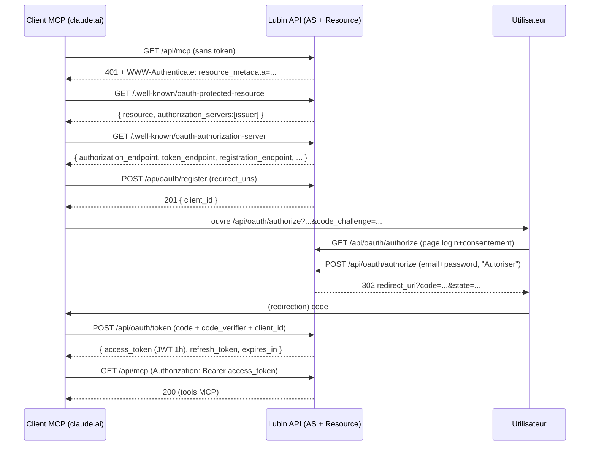

# MCP Lubin Investment — Spécification technique

> Serveur MCP (Model Context Protocol) permettant de relier un compte Lubin
> Investment à un client MCP (en priorité le connecteur **claude.ai**) pour
> interroger le screener, les analyses, les fondamentaux, la résilience et la
> watchlist de l'utilisateur, avec un gating **membre / Pro** identique au site.

Statut : **Phases 0-3 faites** (OAuth + transport MCP + 10 tools + durcissement/upsell), passe de sécurité effectuée. Typecheck et suite de tests verts (179 tests). Reste avant mise en service : appliquer la migration en prod et tester le connecteur réel sur claude.ai (§13). Voir [WORKLOG.md](./WORKLOG.md) pour l'avancement détaillé.

---

## 1. Objectif & décisions

Décisions verrouillées avec le product owner :

| Sujet | Décision |
|---|---|
| Cible v1 | **Grand public via connecteur claude.ai** (ajout en 1 clic) |
| Auth | **OAuth 2.1** (Authorization Code + PKCE), login avec les identifiants Lubin existants |
| Gating | Les tools répondent selon le statut **membre (free) / Pro**, via `isProActive()` côté serveur |
| Portefeuille | **Pas en v1.** À terme persisté côté Lubin (pas dans la conversation). Le pont v1 = la **watchlist** (déjà en DB) |
| Résilience | **Lecture seule** en v1. Génération à la demande = plus tard (le pipeline vit sur la branche `codex/analyze-resilience-ui`, PR #169) |

Non-objectifs v1 : génération de résilience, écriture de portefeuille, analyse GPT qualitative exposée en tool (Pro, phase ultérieure).

---

## 2. Architecture

- **In-repo**, dans l'app Express `apps/api` (déployée en **une seule fonction Vercel** via `api/[...all].ts`). Le MCP est un routeur Express de plus.
- Le endpoint MCP `/api/mcp` est une **OAuth protected resource**. L'app joue AUSSI le rôle d'**Authorization Server** (réutilise l'identité email/password existante).
- Transport MCP (Phase 1) : **Streamable HTTP stateless** via `@modelcontextprotocol/sdk` (chaque requête porte son Bearer, pas de session serveur → adapté au mono-lambda serverless).
- Réutilise le socle existant : `prisma` (`db/client.ts`), `verifyPassword` (`lib/auth.ts`), `isProActive` (`services/stripe.ts`), les services domaine (`quantSnapshot`, `screener`, `resilienceSummary`, `derivedTimeseries`…).

Fichiers introduits en Phase 0 :

```
apps/api/src/lib/oauth.ts            # helpers crypto/tokens (PKCE, JWT MCP, sha256, base URL)
apps/api/src/routes/oauth.ts         # Authorization Server : register / authorize / token + .well-known
apps/api/src/middleware/mcpAuth.ts   # requireMcpAuth (valide le Bearer, pose req.user)
apps/api/src/routes/mcp.ts           # endpoint MCP (stub Phase 0, transport en Phase 1)
apps/api/prisma/schema.prisma        # + OAuthClient / OAuthAuthCode / OAuthRefreshToken
vercel.json                          # + rewrites /.well-known/oauth-*
```

---

## 3. Séquence OAuth & endpoints



### Endpoints

| Méthode | Chemin | Rôle |
|---|---|---|
| GET | `/.well-known/oauth-authorization-server` | Métadonnées AS (RFC 8414) |
| GET | `/.well-known/oauth-protected-resource` | Métadonnées resource (RFC 9728) |
| POST | `/api/oauth/register` | Dynamic Client Registration (RFC 7591) |
| GET | `/api/oauth/authorize` | Page login + consentement |
| POST | `/api/oauth/authorize` | Traite la décision, émet le code, redirige |
| POST | `/api/oauth/token` | `authorization_code` → tokens ; `refresh_token` → tokens (rotation) |
| GET | `/api/mcp/status` | Sonde authentifiée (diagnostic, non-MCP) |
| GET/POST | `/api/mcp` | Transport MCP (Phase 1) |

---

## 4. Modèle de données

Trois tables Prisma (migration `*_mcp_oauth`) :

- **`OAuthClient`** — client enregistré dynamiquement. `redirectUris` = allowlist stricte. Public client + PKCE → `clientSecret` null.
- **`OAuthAuthCode`** — code d'autorisation, `code` en PK, usage unique (`consumedAt`), TTL ~10 min, porte le `codeChallenge` (S256) + `resource`.
- **`OAuthRefreshToken`** — refresh opaque stocké **hashé** (`tokenHash` sha256), révocable (`revokedAt`), à rotation, TTL 60 j.

`User` gagne deux back-relations (`oauthAuthCodes`, `oauthRefreshTokens`, cascade delete). Les **access tokens ne sont pas stockés** (JWT stateless).

---

## 5. Stratégie de tokens

| Token | Forme | Durée | Stockage | Révocation |
|---|---|---|---|---|
| Access token MCP | JWT HS256 (`sub`, `email`, `scope`, `aud`=resource) | 1 h | aucun (stateless) | expiration seule |
| Refresh token | opaque base64url (48 o) | 60 j | `sha256` en DB | `revokedAt` + rotation |
| Code d'autorisation | opaque base64url (32 o) | 10 min | DB (PK) | `consumedAt` (usage unique) |

**Séparation de domaine** : la clé de signature des access tokens MCP est
`AUTH_SECRET + '::mcp-access-v1'`. Un cookie de session web ne peut donc pas être
présenté comme un access token MCP (et inversement). **Aucun nouveau secret** à
provisionner.

---

## 6. Sécurité

- **PKCE S256 obligatoire** (`plain` refusé, conforme OAuth 2.1).
- **redirect_uri en allowlist stricte** (match exact), validé **avant** toute redirection ; `https` exigé (`http` toléré pour `localhost` en dev).
- Codes d'autorisation **usage unique** + TTL court + anti-double-spend par `updateMany` conditionnel atomique.
- Refresh tokens **hashés** au repos, **rotation** à chaque usage.
- Réponses `/token` en `Cache-Control: no-store` ; jamais de token en query string.
- Page de consentement : toutes les valeurs interpolées sont **échappées** (`escapeHtml`) ; `noindex`.
- CORS permissif (`*`, sans credentials) uniquement sur les routes OAuth/MCP (appels Bearer server-to-server) ; le reste garde le CORS restreint.
- **À faire avant merge** : passe `/security-review` dédiée (voir Points ouverts).

---

## 7. Endpoint MCP & tools

### Matrice des tools par palier (v1)

| Tool | Membre (connecté, free) | Pro | Backing existant |
|---|---|---|---|
| `search_ticker` | oui | oui | `/api/screener/search` |
| `analyze_stock` | 10/jour (quota) | illimité | `loadQuantData` / `/api/analyze` |
| `get_resilience` (lecture) | oui | oui | `resilienceSummary.ts` |
| `screen_stocks` | oui | oui | `getTop` / `/api/screener/top` |
| `compare_stocks` | ≤ 2 | ≤ 5 | `/api/compare` |
| `fundamentals_trend` | oui | oui | `/api/timeseries` + trend signals |
| `get_watchlist` / gérer | ≤ 10 | plus / illimité | routes `watchlist` |
| `analyze_watchlist` (composite) | sur ≤ 10 | illimité | fan-out des tools ci-dessus |
| `qualitative_analysis` (GPT) | non | Pro only | `requirePro` (phase ultérieure) |
| `analyze_portfolio` | non | Pro (plus tard) | `PortfolioPosition` + quantités (à créer) |

### Contrats (esquisse, à figer en Phase 1)

- `analyze_stock(ticker)` → note /10, critères pass/warn/fail, valo Buffett, grade résilience, flag opportunité.
- `screen_stocks({ minRatio?, maxPfcf?, sector?, caps?, zones?, opportunities?, limit? })` → lignes classées.
- `analyze_watchlist()` → par ligne (note, tendance fondamentale, grade résilience) + synthèse (maillons faibles, fondamentaux en dégradation).

Schémas d'I/O tirés de `packages/shared/src/index.ts` (`AnalyzeResponse`, `ScreenerTopRow`, `CompareResponse`, `ResilienceAnalysis`, `TimeseriesResponse`…).

---

## 8. Gating (membre / Pro)

Le gating est **orthogonal au scope OAuth** : il se fait côté serveur au moment de
l'appel du tool, en réutilisant exactement les gardes du site :

- `isProActive(user)` (`services/stripe.ts`) — source de vérité Pro.
- Quota d'analyses free (10/24 h) — logique de `enforceDailyAnalysisQuota`.
- Plafonds (compare 2/5, watchlist 10/plus) — mêmes valeurs que les routes HTTP.

Un tool Pro appelé par un membre free renvoie une erreur structurée `PRO_REQUIRED`
+ un lien de checkout (upsell) — canal de conversion (Phase 3).

---

## 9. Déploiement & migrations

- **Migrations = DB prod.** Interdit de lancer `prisma migrate`/`build:vercel` en
  local (le `.env` local pointe sur Neon prod). La migration `*_mcp_oauth` a été
  générée par **diff de schémas hors-ligne** (`prisma migrate diff --from-schema-datamodel … --to-schema-datamodel … --script`), **sans contact DB**.
- Application en prod : via le chemin Vercel existant (`build:vercel` → `scripts/migrate-vercel.mjs`), au déploiement.
- `vercel.json` : ajout des rewrites `/.well-known/oauth-*` → `/api/[...all]` (sinon les métadonnées ne sont pas routées vers la lambda).
- **Config env** : aucun nouveau secret requis (clé MCP dérivée d'`AUTH_SECRET`). `PUBLIC_BASE_URL` optionnel pour forcer l'issuer.

---

## 10. Plan par phases

| Phase | Contenu | État |
|---|---|---|
| 0 | Fondations OAuth : modèles, AS (register/authorize/token), `.well-known`, `requireMcpAuth`, stub `/api/mcp` | **fait** |
| 1 | Transport MCP (SDK v1.30, Streamable HTTP stateless) + tools lecture (`search_ticker`, `analyze_stock`, `get_resilience`, `screen_stocks`, `compare_stocks`, `fundamentals_trend`) + gating membre/Pro | **fait** |
| 2 | Watchlist (`get_watchlist`, `add_to_watchlist`, `remove_from_watchlist`) + `analyze_watchlist` composite + annotations MCP | **fait** |
| 3 | Rate-limits dédiés MCP, mapping d'erreurs + upsell `PRO_REQUIRED` avec lien, passe de sécurité (11 correctifs) | **fait** (test connecteur réel : après déploiement) |
| Ultérieur | Portefeuille persisté (`PortfolioPosition` + quantités, `analyze_portfolio`), génération résilience, `qualitative_analysis` | backlog |

---

## 11. Points ouverts

- **Purge des tokens** : ni `OAuthClient`, ni `OAuthAuthCode`, ni `OAuthRefreshToken` n'ont de
  nettoyage. Les codes expirés et les refresh révoqués s'accumulent (bornés par les
  rate-limits, mais la table grossit). Un job de purge reste à écrire.
- **SSO depuis le cookie site** (login en 1 clic si déjà connecté) : volontairement écarté.
  ⚠ Si on l'ajoute un jour, il FAUT un jeton anti-CSRF : aujourd'hui le formulaire n'en a pas,
  et c'est sûr **uniquement** parce que le mot de passe est exigé dans le corps de la requête.
- **Scopes granulaires** (`watchlist:read`, `watchlist:write`…) : un seul scope `mcp` en v1.
  Le scope est validé mais n'est pas encore un vecteur d'autorisation (le gating reste
  `isProActive`) ; à raffiner si on veut un consentement fin.
- **Révocation utilisateur** : passe aujourd'hui par la réinitialisation du mot de passe (qui
  révoque les refresh tokens). Un écran « applications connectées » serait plus propre.
- **Analyse GPT qualitative** (`qualitative_analysis`, Pro) : pas encore exposée en tool.

---

## 12. Tester la Phase 0 (manuel, sans client MCP)

Une fois la migration appliquée sur un environnement avec DB + `AUTH_SECRET` :

1. `POST /api/oauth/register` avec `{"redirect_uris":["https://example.com/cb"]}` → récupérer `client_id`.
2. Générer un PKCE (`code_verifier` aléatoire, `code_challenge = base64url(sha256(verifier))`).
3. Ouvrir `GET /api/oauth/authorize?response_type=code&client_id=…&redirect_uri=https://example.com/cb&code_challenge=…&code_challenge_method=S256&state=xyz` → page de consentement, se loguer.
4. Récupérer le `code` dans l'URL de redirection.
5. `POST /api/oauth/token` (form-urlencoded) : `grant_type=authorization_code&code=…&redirect_uri=…&client_id=…&code_verifier=…` → `access_token`.
6. `GET /api/mcp/status` avec `Authorization: Bearer <access_token>` → `{ ok: true, authenticated: true, userId }`.

---

## 13. Brancher le connecteur sur claude.ai

**Prérequis de déploiement** (à faire une fois) :

1. La migration `*_mcp_oauth` doit être appliquée en prod. Elle part avec le déploiement
   Vercel (`build:vercel` → `scripts/migrate-vercel.mjs`). **Ne jamais la lancer en local.**
2. Vérifier que `SITE_URL` vaut bien `https://lubin-investment.com` dans les variables
   Vercel. Sans elle, le code retombe sur le domaine de production en dur (donc correct),
   mais la définir explicitement évite toute ambiguïté sur l'issuer OAuth.
3. `AUTH_SECRET` doit être défini (déjà le cas) : la clé des tokens MCP en dérive.

**Vérification post-déploiement** (avant d'ajouter le connecteur) :

```bash
curl -s https://lubin-investment.com/.well-known/oauth-protected-resource | jq
curl -s https://lubin-investment.com/.well-known/oauth-authorization-server | jq
curl -si https://lubin-investment.com/api/mcp -X POST | grep -i www-authenticate
```

Attendu : les deux premiers renvoient du JSON pointant vers `lubin-investment.com`, le
troisième renvoie `401` avec un en-tête `WWW-Authenticate` contenant `resource_metadata`.

**Ajout du connecteur** : dans claude.ai → réglages → connecteurs → ajouter un connecteur
personnalisé, URL `https://lubin-investment.com/api/mcp`. Claude enregistre son client tout
seul (DCR), ouvre la page de consentement, l'utilisateur se logue avec ses identifiants
Lubin Investment, et les tools deviennent disponibles selon son offre (membre / Pro).

**Ce qu'il faut regarder au premier test réel** :
- la page de consentement s'affiche correctement et annonce bien `claude.ai` comme destination ;
- après consentement, `tools/list` remonte les 10 tools ;
- un membre gratuit qui demande une comparaison de 3 titres reçoit `PRO_REQUIRED` + le lien ;
- les logs Vercel ne montrent pas de 405 (signe que le client tente un GET/SSE, ce que le
  mode stateless ne sert pas).
